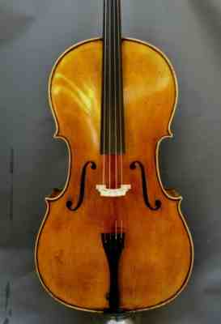

# Encabezado
## Encabezado más pequeño
###  Encabezado más pequeño todavia
Esto es un texto en **negrita** , *cursiva* 
vamos a proceder a hacer una lista:
1. Patata
2. Cebolla
3. Huevos

Ahora una tabla

tITULO 1 DE LA TABLA|TÍTULO 2 DE LA TABLA
--------------------|---------------------
ESTO SERÍA LA CELDA|Y ESTO SERÍA OTRA CELDA
Añado otra celd más| y esta celda de regalo

